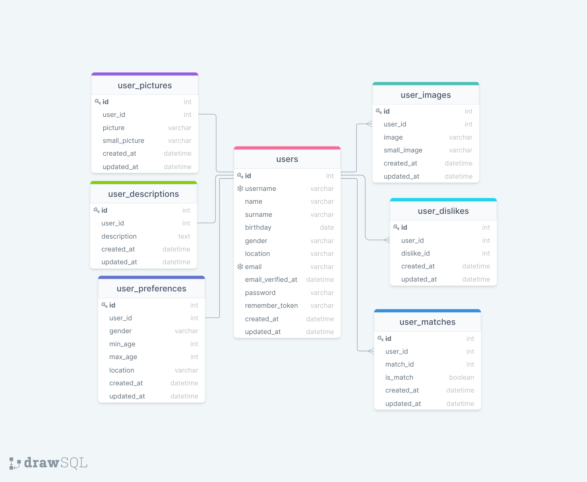

# TINDER APP ❤

Application is build using "Laravel Sail" framework.

####Application has the following MODELS:
- User model and various related models:
  - Description, 
  - Dislike, 
  - Image (images for user gallery, except for the profile picture),
  - Match, 
  - Picture (profile picture) - user cannot have its profile without a picture,
  - Preference.

####Application has the following CONTROLLERS:
- **Description** - controller for creating user description ("About me").
- **Image** - for adding images to user gallery.
  - Images are **stored** in the storage directory 'images'.
- **Match** - responsible about approving ('Yes') or disapproving ('No') of other users and having a match. 
After 2 users are matched, notification mail is sent to both users.- 
- **Password:**
    - **Change** - user in its profile can change his/her password.
    - **Forgot** - if user has forgotten his/her password, user receives email for password reset.
    - **Reset** - after password reset is accepted in the email, 
  user is directed to reset his/her password and after - is directed to log in.
- **Picture** - this controller is responsible about the user profile picture upload, change.
  - Pictures are **stored** in the storage directory 'pictures'.
- **Preference** - user can create filters, based on which he/she can look for other people.
- **Profile** - this controller includes editing of the user profile.
- **Register** - register to be a user of the application. 
- **Sessions** - controller responsible about login and logout.
- **User** - this controller includes functions of displaying all users and view users profile information.

####Application has the following VIEWS:
- **Layout** and **Flash** message blade files are stored under 'Components' directory;
- **Descriptions/create** for creating user description ('About me').
- **Emails/is-match** is a form for the email message, that is received, when two people are matched.
- **Password** directory contain tree views for change-password, forgot-password and reset-password cases.
- **Pictures/create** for uploading/changing profile picture.
- **Register/create** for user registration.
- **Sessions/create** for login.
- Users directory contain the following views:
  - **Edit** - for user profile editing;
  - **Index** - this view is currently copy of 'Home' view.
  - **Match** - displaying all the match history for the user.
  - **Show** - view the individual user profile.
- **Home** view displays all users, based on the user preference filters. 

####Database schema:

                                   ❤ Happy matching!
# AppLikeTinder
